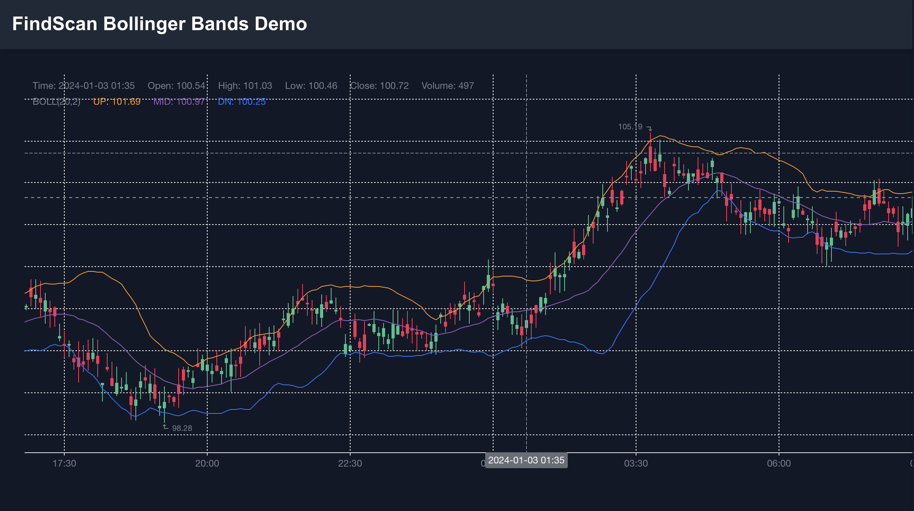
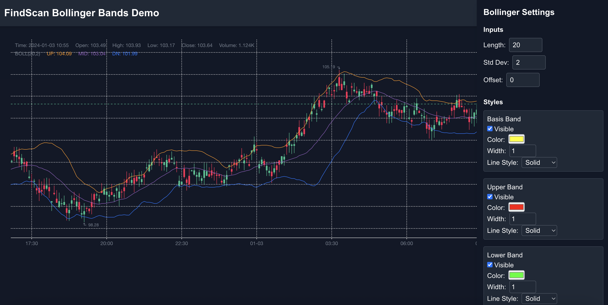

# FindScan — Bollinger Bands Demo (Frontend Intern Assignment)

**Live Demo:** https://findscan-bollinger-nine.vercel.app/

A production-style demo showing a Bollinger Bands indicator implemented with **KLineCharts**, built using **React**, **Next.js (App Router)**, **TypeScript**, and **TailwindCSS**. The UI exposes inputs and style controls, recomputes on changes and data updates, and aims to feel close to TradingView’s settings experience.

---

## Table of Contents
- [Goal](#goal)
- [Tech Stack](#tech-stack)
- [Project Structure](#project-structure)
- [Setup & Run](#setup--run)
- [How to Use / UI Notes](#how-to-use--ui-notes)
- [Formulas & Implementation Notes](#formulas--implementation-notes)
- [KLineCharts Version](#klinecharts-version)
- [Screenshots / GIFs](#screenshots--gifs)
- [Known Issues & Trade-offs](#known-issues--trade-offs)
- [Testing Checklist (Acceptance Criteria)](#testing-checklist-acceptance-criteria)
- [How I Tested Performance](#how-i-tested-performance)
- [Git / Submission Notes](#git--submission-notes)

---

## Goal

Implement a **Bollinger Bands** overlay using only **KLineCharts**:
- Expose the required **Inputs** and **Style** controls.
- Recompute bands on any input change and on data updates.
- Add the indicator idempotently (avoid duplicates).
- Provide a settings UI that feels familiar (TradingView-like).

---

## Tech Stack

- **Next.js** (App Router)
- **React** (client components)
- **TypeScript**
- **TailwindCSS**
- **KLineCharts** (chart library)
- Demo OHLCV JSON from `/public/data/ohlcv.json`

---

## Project Structure

```
/ (Next.js app)
  /app
    page.tsx             # Main page (chart + settings)
    layout.tsx           # App layout + header
  /components
    Chart.tsx            # Chart wrapper (KLineCharts init + update)
    BollingerSettings.tsx# Inputs + Style UI
  /lib
    indicators/
      bollinger.ts       # computeBollingerBands(data, options)
    types.ts             # OHLCV & BollingerOptions types
  /public
    /data/ohlcv.json     # Demo data (200+ candles)
    /screenshots/        # (optional) screenshots for README
README.md
package.json
```

---

## Setup & Run

Clone the repository (or use the ZIP):

```bash
git clone https://github.com/sharmaHarshit2000/findscan-bollinger.git
cd findscan-bollinger
```

Install dependencies:

```bash
npm install
# or
yarn
```

Run the development server:

```bash
npm run dev
# open http://localhost:3000
```

Build for production:

```bash
npm run build
npm start
```

---

## How to Use / UI Notes

Open the app (local or hosted). The page renders a candlestick chart with a Bollinger Bands overlay. The settings panel contains two sections:

**Inputs**
- **Length**: window size for SMA & Std Dev.
- **Std Dev** (multiplier): scales the upper/lower bands.
- **Offset**: shifts the series forward/back by N bars.

**Style**
- Per-band style for **Basis / Upper / Lower**: visibility toggle, color, width (1–5), line style (solid/dashed).
- **Fill area**: visibility toggle, color, opacity.

Behavior:
- Any change immediately recomputes and re-renders the indicator.
- The indicator is added once (idempotent) — re-creating replaces the existing one.
- Crosshair/tooltip displays **basis/upper/lower** for the hovered candle.

---

## Formulas & Implementation Notes

**Basis (Middle Band)**
- `SMA(source, length)` = mean of last `length` closes.

**Standard Deviation (population)**
- variance = (1/N) * Σ (xᵢ − mean)²  
- sd = √variance

**Upper & Lower**
- `Upper = Basis + (multiplier * sd)`  
- `Lower = Basis − (multiplier * sd)`

**Offset**
- Shifts the resulting series by `offset` bars; shifted positions are filled with `NaN`.

Implementation:
- `computeBollingerBands()` is defined in **`/lib/indicators/bollinger.ts`**.
- Recomputed on: initial data load, settings updates (length, stdDev, offset, style), and data updates.
- Tooltip uses the computed series values under the cursor.

---

## KLineCharts Version

- Project pins **`klinecharts@9.4.0`** (see `package.json`).  
- **Note:** v10 introduces API/typing changes; the project targets v9 to keep a stable API for this assignment.

---

## Screenshots / GIFs


```markdown


```

---

## Known Issues & Trade-offs

- **KLineCharts v10 compatibility**: v10 (alpha) changed indicator APIs/types. This demo uses v9.4.0. Migrating to v10 would require adopting new `createIndicator` / override signatures and TS updates.
- **Style updates**: In v9, the simplest reliable approach is to re-create the indicator on style changes. With current data sizes, this is fast and avoids edge cases.
- **Tooltip**: Shows basis/upper/lower values. A custom legend layout can be implemented if desired.
- **Performance**: Re-creating the indicator is acceptable for ~200–1,000 candles. For very large datasets or high-frequency updates, we’d consider more granular updates (if supported by the lib).
- **Types / TS warnings**: v10’s typings can mismatch runtime options. Targeting v9 avoids this. If upgrading, we may need to rework types or use selective `@ts-ignore`.

---

## Testing Checklist (Acceptance Criteria)

- [ ] Indicator can be added once via the UI (idempotent create).
- [ ] Settings panel with **Inputs** and **Style** works.
- [ ] Changing **Length** (small → large) updates basis/bands immediately.
- [ ] Changing **Std Dev** expands/contracts upper/lower as expected.
- [ ] **Offset** shifts bands by N bars in the correct direction.
- [ ] Style toggles (**visible/color/width/line style**) reflect on the chart.
- [ ] **Fill area** toggling and opacity are applied.
- [ ] Crosshair tooltip shows **Basis/Upper/Lower** for hovered candle.
- [ ] Smooth performance with ~200–1,000 candles.

---

## How I Tested Performance

- Loaded demo JSON with ~240 candles (`/public/data/ohlcv.json`).
- Repeated settings changes (Length, width, dashed/solid) and observed immediate updates without jank (Chrome desktop).
- Spot-checked tooltip values against computed series.

---

## Git / Submission Notes

- Keep commits focused (indicator logic, UI, refactors).
- Ensure `klinecharts` stays pinned to **9.4.0** to avoid breaking API changes.
- If migrating to v10 later, do it in a separate branch (adjust types & indicator APIs).
